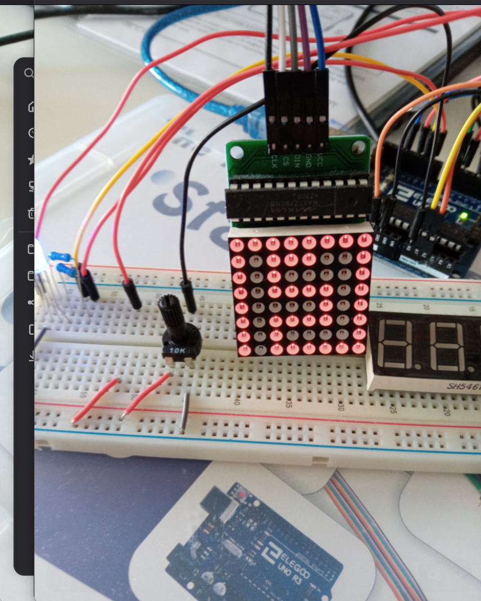
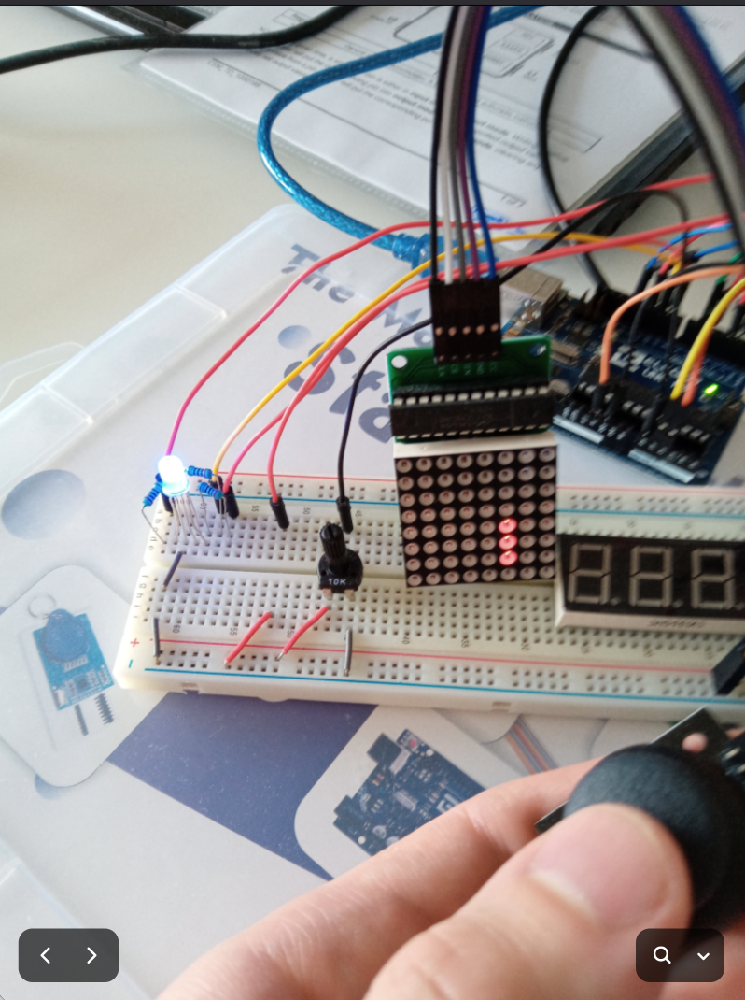
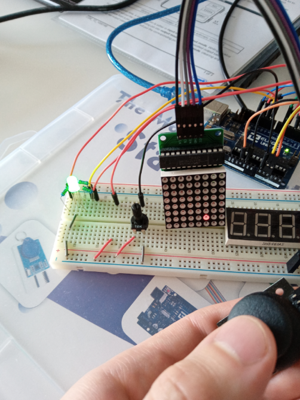

# Snake game

## Current status

** Completed **

## Installation

	- Compile and upload the code using Arduino IDE.

## Usage

	Use:
	* joystick to navigate snake
	  - ↑ :		Up
	  - ↓ :		Down
	  - ← :		Left
	  - → :		Right
	* potentiometer to slow down / speed up (turn 45 degrees to the left / right).
	* pause (toggle) button to pause/unpause the game
	* reset button to start again

### Dynamic RGB LED Color Indicators for Event Status

Throughout the gameplay the RGB LED will emit blue light. During the pause the LED
will emit purple light. In case of stop, reset or game over LED will have red color.
When snake finds food - green color will light up.

## Project build

### Hardware Components

- Arduino MEGA2560 R3 board
- 1x LED matrix MAX7219
- joystick module
- potentiometer 10k
- 2x push button
- 1x RGB led
- 3x 330 Ohm resistors
- 1x 10k resistor
- jump wires
- breadboard

### Circuit Description

* connect RGB LED through 330 Ohm resistors to pins 8, 9 and 10. 4th pin to GND
* connect push button (reset button) to pin 2, 5V pin and GND with 10K resistor 
* connect push button (pause button) to pin 3 and GND
* connect 10k potentiometer (game's speed control) to A0, with other connectors
  to GND and 5V
* LED matrix max7219
	- VCC: to Arduino 5V
	- GND: to Arduino GND
	- DIN (Data In): to pin 41
	- CLK (Clock): to pin 45
	- CS (Chip Select): to pin 43
* joystick's x and y pins to A1, A2; GND and 5V pins to corresponding pins on
  Arduino board

### Project Note

The segment display has been omitted from this project due to concerns over overload
on the Arduino's power supply.

## Images

 

