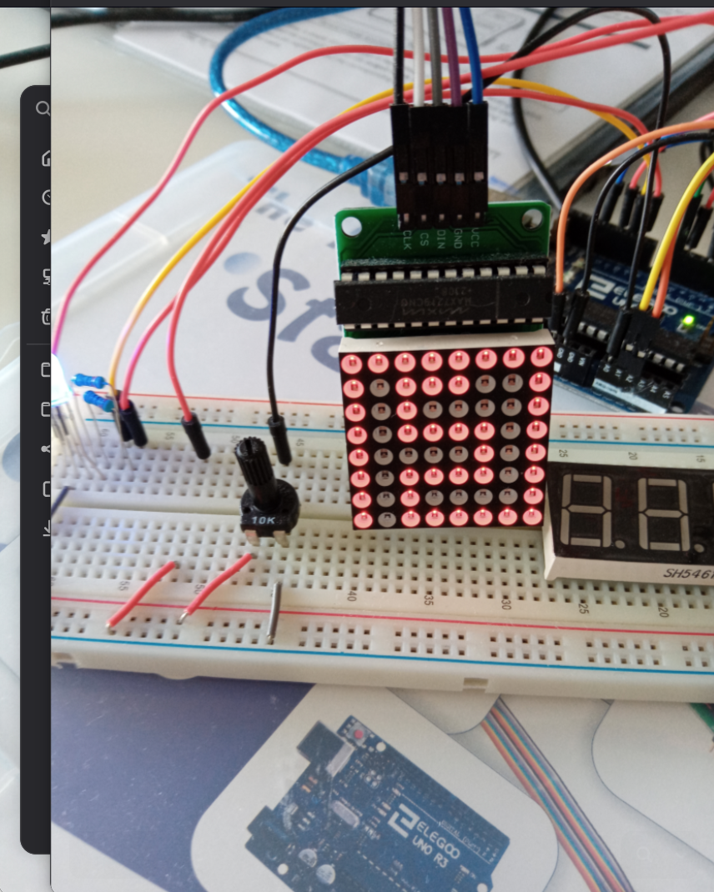
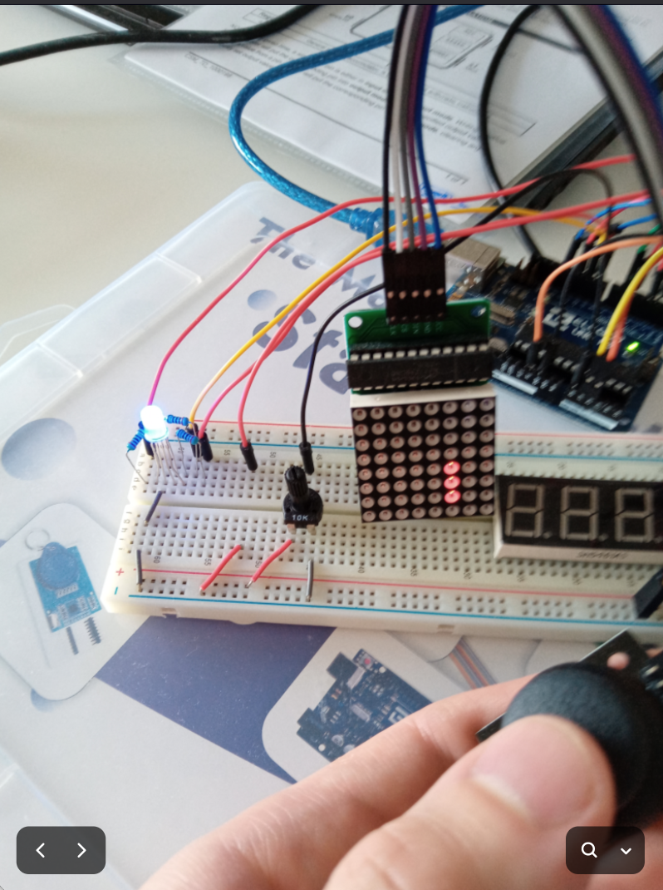
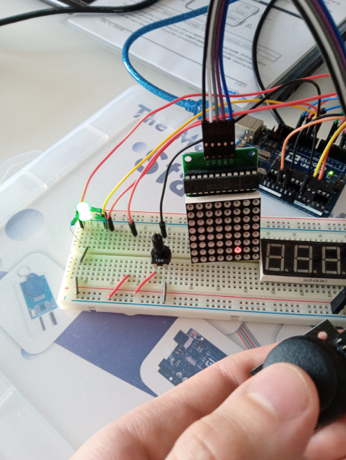

# Snake game

## Current status

** Completed **

## Description

Arduino-based Snake game built on the Arduino Mega 2560. The game is displayed
on an LED Display module, where the snake moves across the grid, grows when it
“eats” food, and ends on collision with itself.

User input is handled via a joystick, enabling directional control of the
snake. A dedicated pause button allows stopping/resuming the game, while a
reset button restarts it. A speed regulator (e.g., potentiometer) adjusts the
snake’s movement speed in real time, increasing or decreasing difficulty.

An additional RGB LED provides visual feedback (e.g., game state, collision,
or score indication). The system integrates game logic, real-time input
handling, and hardware control (matrix display, buttons, and analog speed
input).

### Dynamic RGB LED Color Indicators for Event Status

Throughout gameplay, the RGB LED emits blue light. During a pause, it turns
purple. In the event of a reset or collision, the LED turns red. When the snake
finds food, it lights up green.

## Installation

- Open the project in Arduino IDE (2.3.8 or compatible)
- Select Arduino Mega 2560 and the correct port
- Compile and upload the code

## Usage

	* joystick to navigate snake
	  - ↑ :	    Up
	  - ↓ :	    Down
	  - ← :	    Left
	  - → :	    Right
	* potentiometer to slow down / speed up (rotate 45 degrees to the left / right).
	* pause (toggle) button to pause/unpause the game
	* reset button to restart the game

## Project build

### Hardware Components

- Arduino MEGA 2560 R3 board
- 1x LED matrix MAX7219
- joystick module
- potentiometer 10k
- 2x push button
- 1x RGB led
- 3x 330 Ohm resistors
- 1x 10k resistor
- jump wires
- breadboard

### Circuit Description

* Connect the RGB LED through 330 Ω resistors to pins 8, 9, and 10; connect the
  fourth pin to GND
* Connect the reset push button to pin 2, 5V and GND with a 10 kΩ resistor
* Connect the pause push button to pin 3 and GND
* Connect a 10 kΩ potentiometer (game speed control) to A0, with the other pins
  to GND and 5V
* LED Display matrix (MAX7219):
	- VCC: to Arduino 5V pin
	- GND: to Arduino GND pin
	- DIN (Data In): pin 41
	- CLK (Clock): pin 45
	- CS (Chip Select): pin 43
* Connect the joystick X and Y pins to A1 and A2; connect GND and 5V to the
  corresponding Arduino pins

## Images

 

