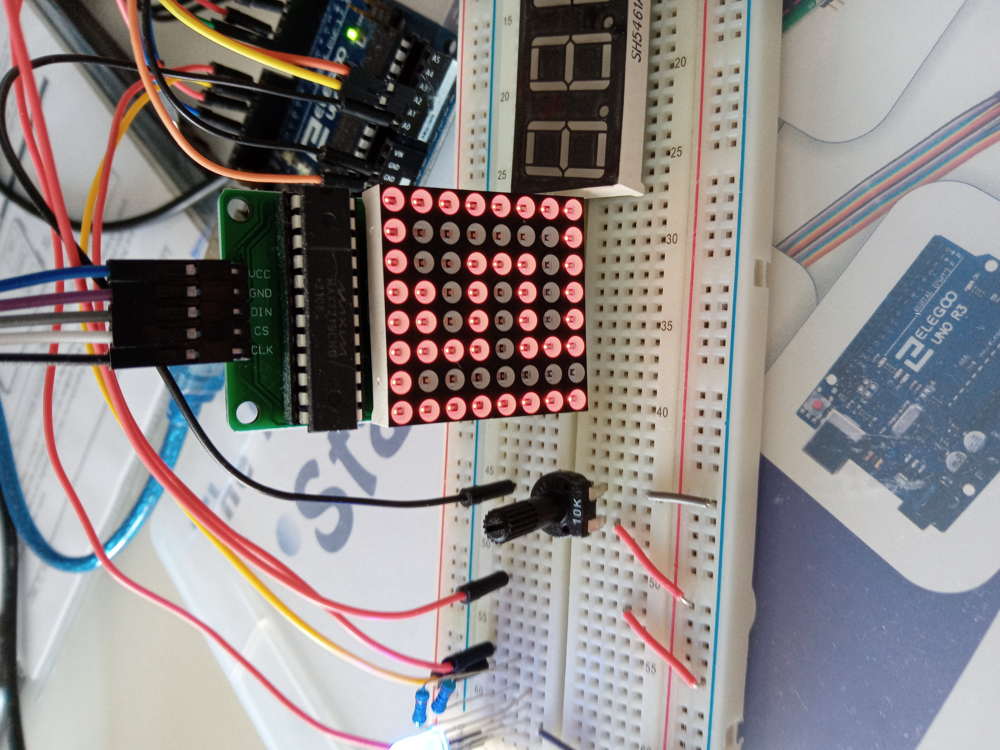

# Snake game based on Arduino board

## Current status

** work in progress **

## Installation

	- To assemble hardware see description in file Snake.ino
	- Compile and upload the code to Arduino using Arduino IDE.

## Usage

	Use:
	* joystick to navigate snake
	  - Up:		↑
	  - Down:	↓     
	  - Left:	←     
	  - Right:	→
	* potentiometer to slow down / speed up (turn 45 degrees to the left / right).

## Images

 

## Necessary Components for the game

- Uno R3 controller board
- joystick module
- potentiometer 10k
- LED matrix MAX7219 8x8
- 4 digit display
- push / switch button

## TODO

- fix snake collision
- add display score
- add score reset button
